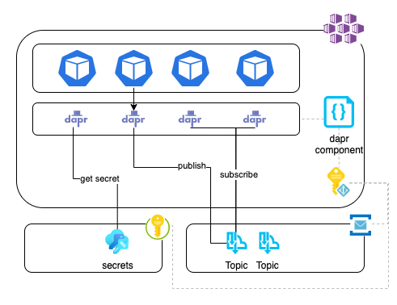
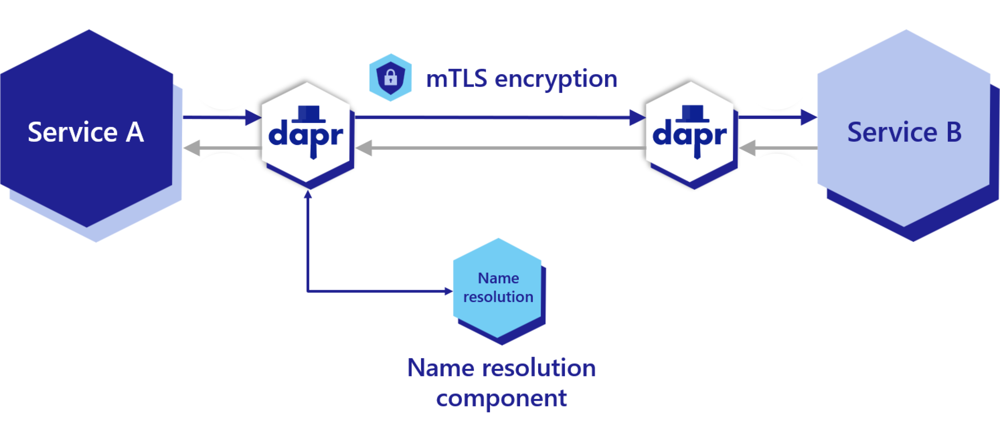
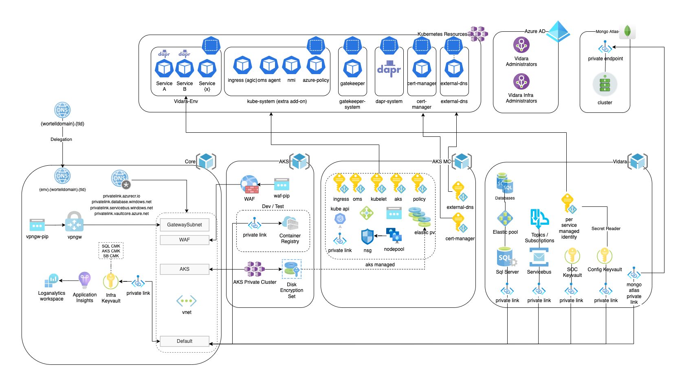

# Challenge

[Wortell](https://www.wortell.nl/en) is a leading Microsoft partner operating its services in the Netherlands, Belgium and Luxembourg. Wortell provides a cloud-native [Managed Detect and Response (MDR)](https://www.wortell.nl/en/products/managed-detection-and-response-en) service to secure its clients based on Microsoft Sentinel and Microsoft Defender 365, operating 24/7/365 by a team of dedicated security professionals.

The service is facilitated by a built for purpose, home grown software solution running on .NET, called **Vidara**, which handles key aspects of connecting to multiple customers, executing MDR and SOC processes, response automation, and more. The software solution consists of many microservices, runs on Kubernetes, interacts with cloud resources and is continuously expanding with new capabilities.

As the software matures, it became exponentially more difficult to focus the engineering effort on the business goals, as the infrastructure and application architecture transformed into an ever more complex system. Evolving the software required more and more specialized expertise and time from the developers, impacting the overall velocity of the team.

# Solution

To deal with the ever increasing complexity of the application and infrastructure architecture, Wortell adopted [**Dapr**](https://dapr.io/). Dapr solves many of the responsibilities of interacting with infrastructure and simplifies the inter-application communication. As the Vidara team where already using Kubernetes (Azure Kubernetes Service, AKS) and deployed their application with Helm charts, the sidecar architecture of Dapr was an easy fit for them to use. At first they started utilizing the pub/sub API and component and over time they gradually started using the other APIs components as well. Currently the team are using pub/sub, secrets, secure service-to-service invocation and are planning on using the state management API and policy features in the near future.

# Impact

By adopting Dapr, the Vidara team were able to remove several software packages and a considerable amount of code from all of their microservices. They adopted the simple Dapr APIs from the [.NET SDK](https://docs.dapr.io/developing-applications/sdks/dotnet/) and thereby offloaded dealing with the infrastructure integration and async inter process communication to the Dapr runtime. This greatly reduced the complexity and amount of required infrastructure related code, allowing them to have more focus on the business features.

# Vidara and Dapr

Vidara handles multiple customers, MDR / SOC processes, automation, and more. It processes data from customers that subscribe to the service by interacting with their Microsoft Sentinel instances, which are loaded with Wortell developed, security detection use cases. Vidara applies automated analysis and triaging to filter out and close false positives security issues or escalates issues to security analysts to facilitate their input into a process (assignment, logging, running automations, etc).

With Vidara, Wortell started using Dapr in production with the 0.12 preview version in February 2021. Since then, as Dapr more to stable v1.0 release and they become more familiar with Dapr, and adopted more and more components and features.

## Vidara Application architecture

The first API Vidara adopted was [pub/sub](https://docs.dapr.io/developing-applications/building-blocks/pubsub/pubsub-overview/). Doing this enabled the development team to remove multiple libraries and code paths dealing with Azure Service Bus and RabbitMQ. Next they started using the secrets API and components. As this component only deals with getting secrets, not setting them, they where able to remove the libraries dealing with Azure KeyVault from all their services besides the one that handles the writing of the secrets.

Service-to-service communication was next. Using the [service to service invocation API](https://docs.dapr.io/developing-applications/building-blocks/service-invocation/service-invocation-overview/) with Dapr results in secure, mTLS based communication with service discovery.

With the latest versions of Dapr, [Azure Managed Identities became supported](https://docs.dapr.io/developing-applications/integrations/azure/authenticating-azure/#using-managed-service-identities). This allows Dapr components to interact with Azure resources without the need to have any configured secrets. Wortell started using the AKS Managed Pod Identity to provide Dapr with the required managed identity access and since then, all secrets in application configuration / helm chart(s) have been removed, making the code considerable more secure. Most recently the Vidara team adopted the Dapr .NET secret store configuration provider. This allows Dapr to pre-fetch application specific secrets from any secrets provider (in their case, Azure KeyVault) and inject them into the application configuration for use. The remaining application secrets are now provided at startup completely removing the need to have any of these secrets in application settings or configuration files.

## Vidara Infrastructure

The Vidara infrastructure is running on Azure Kubernetes Service and interfaces with a number of Azure and MongoDB resources. Besides application specific needs, there are also resources involved with manageability and security requirements. To manage all this, Wortell uses GitHub Workflows together with Pulumi for infrastructure lifecycle management. Managing the environment strictly follows processes where permissions are acquired only when needed and, for example, private connectivity is established.

## Local Development made easy

By using Dapr, local development was greatly simplified for Wortell developers. They switched from running a local Kubernetes cluster to using [Microsoft project Tye](https://devblogs.microsoft.com/dotnet/introducing-project-tye/) together with Dapr. Using Tye, they can easily use Dapr component configurations (yaml files) with locally deployed system software without having to hard code. For example, they used to have code paths that dealt with Azure Service Bus for dtap and RabbitMQ for local development, switching desired targets by supplying application configuration at startup. Now with Dapr, they still target Azure Service Bus for dtap, switching to Redis Dapr components for local development, and the application code  isn't aware of any of this. Using Dapr, configurating and interfacing with these systems is fully external to the application and makes the transistion from local development to the cloud seemless. 

## Business benefits
Using Vidara, built with Microsoft Azure & Dapr, as the backend for their security operations, Wortell has a robust and scalable Managed Detection & Response (MDR) platform that together with Microsoft Sentinel and Microsoft Defender 365 can investigate and respond to cyber threats. With this solution, Wortell needs less people on staff, is quick to respond, and has the means to deliver innovative solutions like its HoneyNetwork (tm) for tailored customer threat intelligence.